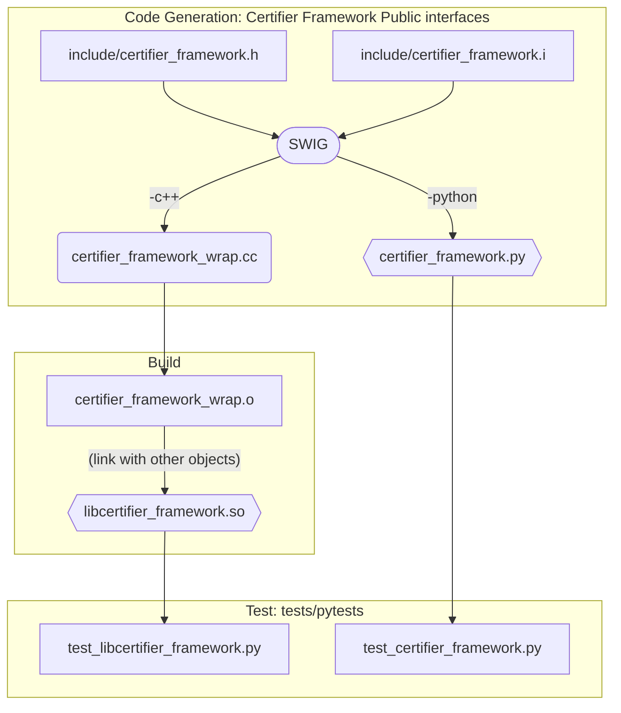
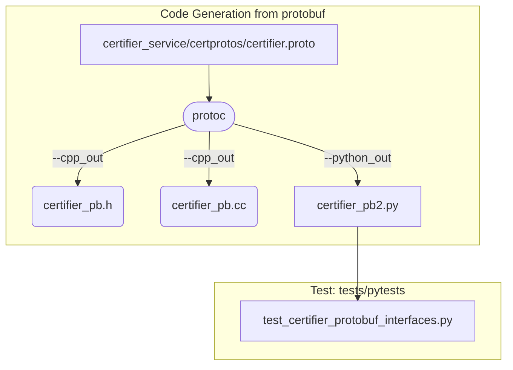

# Python Bindings to Certifier Framework interfaces

This document describes the build workflow and toolchain used to generate and
use Python bindings to access Certifier Framework interfaces

NOTE: This build-infrastructure to generate Python bindings to access
Certifier classes and interfaces is evolving and under development.

## Build process

We use the [SWIG tool](https://www.swig.org/) to generate Python and C++ wrappers
around public Certifier Framework interfaces. The genereated C++ classes and code
is then used to produce a shared library.

We also use the
[Python support in the protobuf compiler](https://protobuf.dev/getting-started/pythontutorial/)
to generate Python wrappers for message-formats described by the
[certifier.proto](../certifier_service/certprotos/certifier.proto)
protobuf file.

The following picture describes the build workflow.
The build instructions are in the [certifier.mak](../src/certifier.mak) file.

These generated Python modules are then used to develop Python-apps to access
the Certifier Service.

