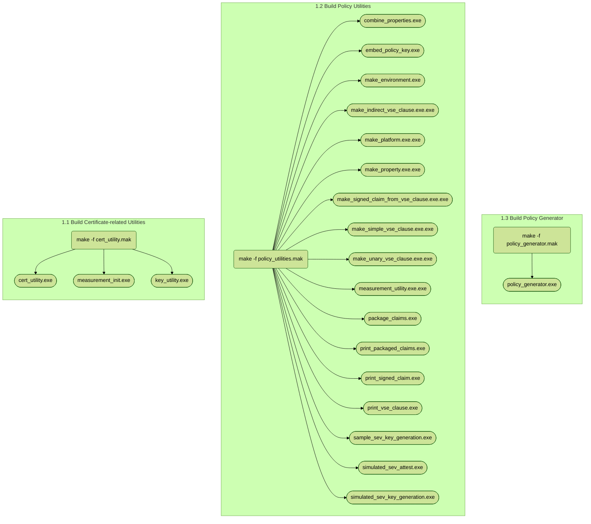
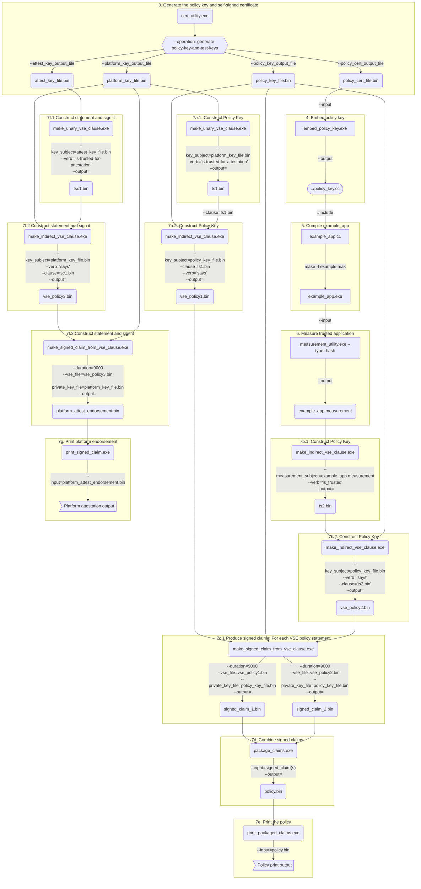
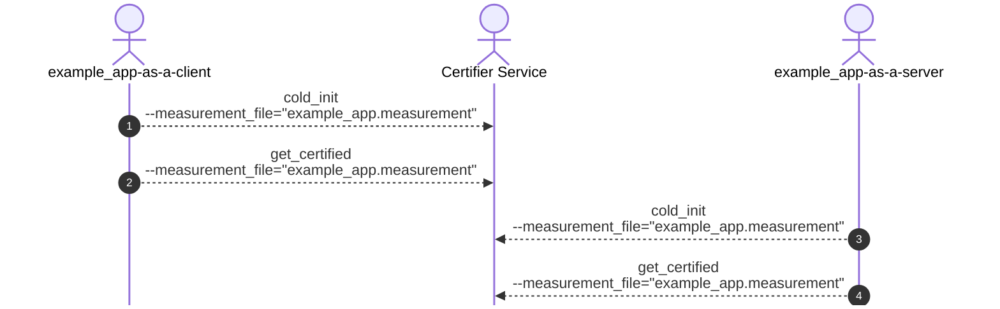
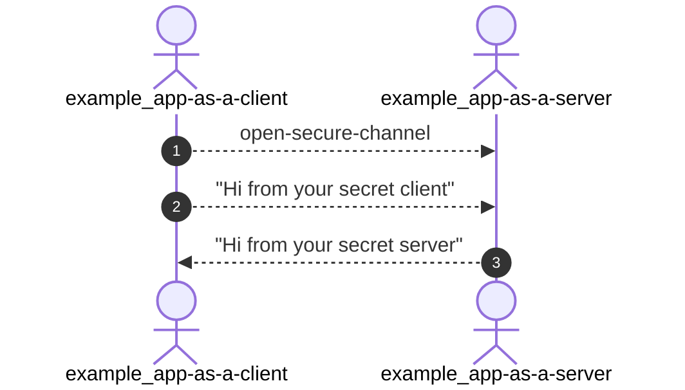

# Simple App - Instructions

This document gives detailed instructions for building and running the sample
application and generating the policy for the Certifier Service using the policy
utilities.

This simple_app sample program provides an example of initializing
and provisioning the Certifier Service with utility-generated keys,
measurements and policy.

The sample program will still need to construct the statement "The attestation-key says the
enclave-key speaks-for the program".  This is the attestation.

Except for the ancillary files `attest_key_file.bin`, `example_app.measurement` and
`platform_attest_endorsement.bin` which are needed because of the simulated-enclave,
this example closely models the steps needed for a real (but simple) deployment. In addition,
this example embeds the policy key in the application using `embed_policy_key.exe`.

Read the [policy_key_notes.txt](policy_key_notes.txt) in the `simple_app` directory and
[policy_utilities_info.txt](../../utilities/policy_utilities_info.txt) as  a background.

$CERTIFIER_PROTOTYPE is the top level directory for the Certifier repository.
It is helpful to have a shell variable for it, e.g., :

```shell
export CERTIFIER_PROTOTYPE=~/Projects/certifier-framework-for-confidential-computing
```

$EXAMPLE_DIR is this directory containing the example application.  Again, a shell variable
is useful.

```shell
export EXAMPLE_DIR=$CERTIFIER_PROTOTYPE/sample_apps/simple_app
```

## Workflow

Here is a pictorial depiction of the overall workflow you need to follow to build
and execute this simple app.

###  Build Workflow


----

###  Policy & Certificate Generation Workflow


----

### Run the apps and get admission certificates from Certifier Service


----

###  Connect the client/server apps (without Certifier Service)


----
## Step 1: Build the utilities

```shell
cd $CERTIFIER_PROTOTYPE/utilities
make -f cert_utility.mak
make -f policy_utilities.mak
```

## Step 2:  Create a directory for provisioning the files
```shell
mkdir $EXAMPLE_DIR/provisioning
```


## Step 3: Generate the policy key and self-signed certificate

```shell
cd $EXAMPLE_DIR/provisioning

$CERTIFIER_PROTOTYPE/utilities/cert_utility.exe          \
      --operation=generate-policy-key-and-test-keys      \
      --policy_key_output_file=policy_key_file.bin       \
      --policy_cert_output_file=policy_cert_file.bin     \
      --platform_key_output_file=platform_key_file.bin   \
      --attest_key_output_file=attest_key_file.bin
  ```

This will also generate the attestation key and platform key for these tests.

## Step 4: Embed the policy key in example_app
```shell
cd $EXAMPLE_DIR/provisioning

$CERTIFIER_PROTOTYPE/utilities/embed_policy_key.exe      \
      --input=policy_cert_file.bin                       \
      --output=../policy_key.cc
```

## Step 5: Compile example_app with the embedded policy_key

```shell
cd $EXAMPLE_DIR

make -f example_app.mak
```

## Step 6: Obtain the measurement of the trusted application for this security domain.
```shell
cd $EXAMPLE_DIR/provisioning

$CERTIFIER_PROTOTYPE/utilities/measurement_utility.exe      \
        --type=hash                                         \
        --input=../example_app.exe                          \
        --output=example_app.measurement
```

## Step 7: Author the policy for the security domain and produce the signed claims the apps need

```shell
cd $EXAMPLE_DIR/provisioning
```

### a. Construct policyKey says platformKey is-trusted-for-attestation

```shell
$CERTIFIER_PROTOTYPE/utilities/make_unary_vse_clause.exe    \
      --key_subject=platform_key_file.bin                   \
      --verb="is-trusted-for-attestation"                   \
      --output=ts1.bin

$CERTIFIER_PROTOTYPE/utilities/make_indirect_vse_clause.exe    \
      --key_subject=policy_key_file.bin                        \
      --verb="says"                                            \
      --clause=ts1.bin                                         \
      --output=vse_policy1.bin
```

### b. Construct  policy key says measurement is-trusted

```shell
$CERTIFIER_PROTOTYPE/utilities/make_unary_vse_clause.exe    \
      --key_subject=""                                      \
      --measurement_subject=example_app.measurement         \
      --verb="is-trusted"                                   \
      --output=ts2.bin

$CERTIFIER_PROTOTYPE/utilities/make_indirect_vse_clause.exe    \
      --key_subject=policy_key_file.bin                        \
      --verb="says"                                            \
      --clause=ts2.bin                                         \
      --output=vse_policy2.bin
```

### c. Produce the signed claims for each vse policy statement.
```shell
$CERTIFIER_PROTOTYPE/utilities/make_signed_claim_from_vse_clause.exe    \
      --vse_file=vse_policy1.bin                                        \
      --duration=9000                                                   \
      --private_key_file=policy_key_file.bin                            \
      --output=signed_claim_1.bin

$CERTIFIER_PROTOTYPE/utilities/make_signed_claim_from_vse_clause.exe    \
      --vse_file=vse_policy2.bin                                        \
      --duration=9000                                                   \
      --private_key_file=policy_key_file.bin                            \
      --output=signed_claim_2.bin
```

### d. Combine signed policy statements for Certifier Service use

```shell
$CERTIFIER_PROTOTYPE/utilities/package_claims.exe     \
      --input=signed_claim_1.bin,signed_claim_2.bin   \
      --output=policy.bin
```

### e. [optional] Print the policy

```shell
$CERTIFIER_PROTOTYPE/utilities/print_packaged_claims.exe --input=policy.bin
```

### f. Construct statement "platform-key says attestation-key is-trusted-for-attestation" and sign it

```shell
$CERTIFIER_PROTOTYPE/utilities/make_unary_vse_clause.exe    \
      --key_subject=attest_key_file.bin                     \
      --verb="is-trusted-for-attestation"                   \
      --output=tsc1.bin

$CERTIFIER_PROTOTYPE/utilities/make_indirect_vse_clause.exe    \
      --key_subject=platform_key_file.bin                      \
      --verb="says"                                            \
      --clause=tsc1.bin                                        \
      --output=vse_policy3.bin

$CERTIFIER_PROTOTYPE/utilities/make_signed_claim_from_vse_clause.exe    \
      --vse_file=vse_policy3.bin                                        \
      --duration=9000                                                   \
      --private_key_file=platform_key_file.bin                          \
      --output=platform_attest_endorsement.bin
```

### g. [optional] Print it

```shell
$CERTIFIER_PROTOTYPE/utilities/print_signed_claim.exe --input=platform_attest_endorsement.bin
```


## Step 8: Build SimpleServer

You should have gotten the protobuf compiler (protoc) for Go when you got Go.
If not, do:

```shell
go install google.golang.org/protobuf/cmd/protoc-gen-go@latest
```
Compile the protobuf

```shell
cd $CERTIFIER_PROTOTYPE/certifier_service/certprotos

protoc --go_opt=paths=source_relative --go_out=. --go_opt=M=certifier.proto ./certifier.proto
```
  Compile the oelib for OE host verification

```shell
cd $CERTIFIER_PROTOTYPE/certifier_service/oelib

make
```

  If you do not have OE SDK installed or do not want to enable OE:
```shell
make dummy
```

  Compile the teelib for running the certifier service inside a TEE
```shell
cd $CERTIFIER_PROTOTYPE/certifier_service/teelib

make
```

This should produce a Go file for the certifier protobufs called certifier.pb.go in certprotos.
Now build simpleserver:

```shell
cd $CERTIFIER_PROTOTYPE/certifier_service

go build simpleserver.go
```

## Step 9: Create directories for app data

```shell
cd $EXAMPLE_DIR

mkdir app1_data app2_data
```

## Step 10: Create a directory for service data

```shell
mkdir $EXAMPLE_DIR/service
```

## Step 11: Provision the app files

Note: These files are required for the "simulated-enclave" which cannot measure
the example app and needs a provisioned attestation key and platform certificate.
On real hardware, these are not needed.

```shell
cd $EXAMPLE_DIR/provisioning

cp -p ./* $EXAMPLE_DIR/app1_data
cp -p ./* $EXAMPLE_DIR/app2_data
```


## Step 12: Provision the service files
```shell
cd $EXAMPLE_DIR/provisioning

cp -p policy_key_file.bin policy_cert_file.bin policy.bin $EXAMPLE_DIR/service
```

## Step 13: Start the Certifier Service

In a new terminal window:

```shell
cd $EXAMPLE_DIR/service

$CERTIFIER_PROTOTYPE/certifier_service/simpleserver   \
      --policyFile=policy.bin                         \
      --readPolicy=true
```

## Step 14:  Run the apps and get admission certificates from Certifier Service
Open two new terminals (one for the example app running as a client and one for the
same example app running as a server):

In the app-as-a-client terminal run the following:

```shell
cd $EXAMPLE_DIR

$EXAMPLE_DIR/example_app.exe                       \
      --data_dir=./app1_data/                      \
      --operation=cold-init                        \
      --measurement_file="example_app.measurement" \
      --policy_store_file=policy_store
      --print_all=true

$EXAMPLE_DIR/example_app.exe                       \
      --data_dir=./app1_data/                      \
      --operation=get-certified                    \
      --measurement_file="example_app.measurement" \
      --policy_store_file=policy_store             \
      --print_all=true
```

In the app-as-a-server terminal run the following:

```shell
cd $EXAMPLE_DIR

$EXAMPLE_DIR/example_app.exe                       \
      --data_dir=./app2_data/                      \
      --operation=cold-init                        \
      --measurement_file="example_app.measurement" \
      --policy_store_file=policy_store
      --print_all=true

$EXAMPLE_DIR/example_app.exe                       \
      --data_dir=./app2_data/                      \
      --operation=get-certified                    \
      --measurement_file="example_app.measurement" \
      --policy_store_file=policy_store             \
      --print_all=true
```

At this point, both versions of the app have their admission certificates.  You can look at
the output of the terminal running simpleserver for output.  Now all we have to do is have
the apps connect to each other for the final test.  **The Certifier Service is no longer needed
at this point.**


## Step 15:  Run the apps to test trusted services

### a. In the app-as-a-server terminal run the following:

```shell

cd $EXAMPLE_DIR

$EXAMPLE_DIR/example_app.exe           \
      --data_dir=./app2_data/          \
      --operation=run-app-as-server    \
      --policy_store_file=policy_store \
      --print_all=true
```

### b. In the app-as-a-client terminal run the following:

```shell
cd $EXAMPLE_DIR

$EXAMPLE_DIR/example_app.exe           \
      --data_dir=./app1_data/          \
      --operation=run-app-as-client    \
      --policy_store_file=policy_store \
      --print_all=true
```

You should see the message "Hi from your secret server" in the client terminal window and
"Hi from your secret client".

If so, **Congratulations! Your first Confidential Computing program worked!**

-------
## Notes on real deployment and measurements

simpleserver is complete enough to serve as a server for a security domain.  In practice,
unlike this example, there will be multiple trusted measurements and possibly multiple
approved platform keys.  To accomodate these, you will have to repeat steps 7(a) and 7(b)
for these, putting them in unique files and including them in the 7(c).

### There is also **support for logging**.

To enable it add the following calls to the simplserver invocation.

```shell
    --enableLog=true
    --logDir="<dir-name>"       # the directory name where you want your log files
    --logFile="<log-file-name>" # the log file name for the log
```

You can change the starting log file sequence number using: ```--loggingSequenceNumber=3141 ```

### Platform-specific tools

As part of program measurement, each platform has a tool that takes an application
and produces a measurement which is used to construct the policy.

* The utility `measurement_utility.exe` does this in step 6 above for the simulated enclave.
* For SEV, you can obtain the corresponding tool from https://github.com/AMDESE/sev-tool.
* When Open Enclaves is used for SGX development, the oesign tool should be used.  This
can be obtained from https://github.com/openenclave/openenclave/tree/master/tools/oesign.
* These tools both produce a file containing the binary measurement which should
be used in step 7(a), above.

* For the Intel tool, see
https://github.com/intel/linux-sgx/blob/master/sdk/sign_tool/SignTool/sign_tool.cpp


-----
## Below are commands for general testing:

Other commands that can be run in the app-as-a-client terminal.

The operations are: _cold-init_, _get-certified_ and _run-app-as-client_.

**NOTE: --data_dir=./app1_data/** in these examples.

```shell
./example_app.exe                               \
      --data_dir=./app1_data/                   \
      --operation=cold-init                     \
      --policy_cert_file=policy_cert_file.bin   \
      --policy_store_file=policy_store          \
      --print_all=true

./example_app.exe                               \
      --data_dir=./app1_data/                   \
      --operation=get-certified                 \
      --policy_cert_file=policy_cert_file.bin   \
      --policy_store_file=policy_store          \
      --print_all=true

./example_app.exe                               \
      --data_dir=./app1_data/                   \
      --operation=run-app-as-client             \
      --policy_cert_file=policy_cert_file.bin   \
      --policy_store_file=policy_store          \
      --print_all=true
```
Similar sequence of commands can be run in the app-as-a-server terminal, with the final command being _run-app-as-server_ in this case:

**NOTE: --data_dir=./app2_data/** in these examples.

```shell
./```

### b. Produce the signed claims for each vse policy statement.
```shell

example_app.exe                                 \
      --data_dir=./app2_data/                   \
      --operation=cold-init                     \
      --policy_cert_file=policy_cert_file.bin   \
      --policy_store_file=policy_store          \
      --print_all=true

./example_app.exe                               \
      --data_dir=./app2_data/                   \
      --operation=get-certified                 \
      --policy_cert_file=policy_cert_file.bin   \
      --policy_store_file=policy_store          \
      --print_all=true

./example_app.exe                               \
      --data_dir=./app2_data/                   \
      --operation=run-app-as-server             \
      --policy_cert_file=policy_cert_file.bin   \
      --policy_store_file=policy_store          \
      --print_all=true
```

## Go setup

```shell
export GOPATH=$HOME
export GOROOT=/usr/local/go
export PATH=$PATH:$GOROOT/bin
export GO111MODULE=off
go mod init
go mod tidy
go mod init certifier.pb.go
```

